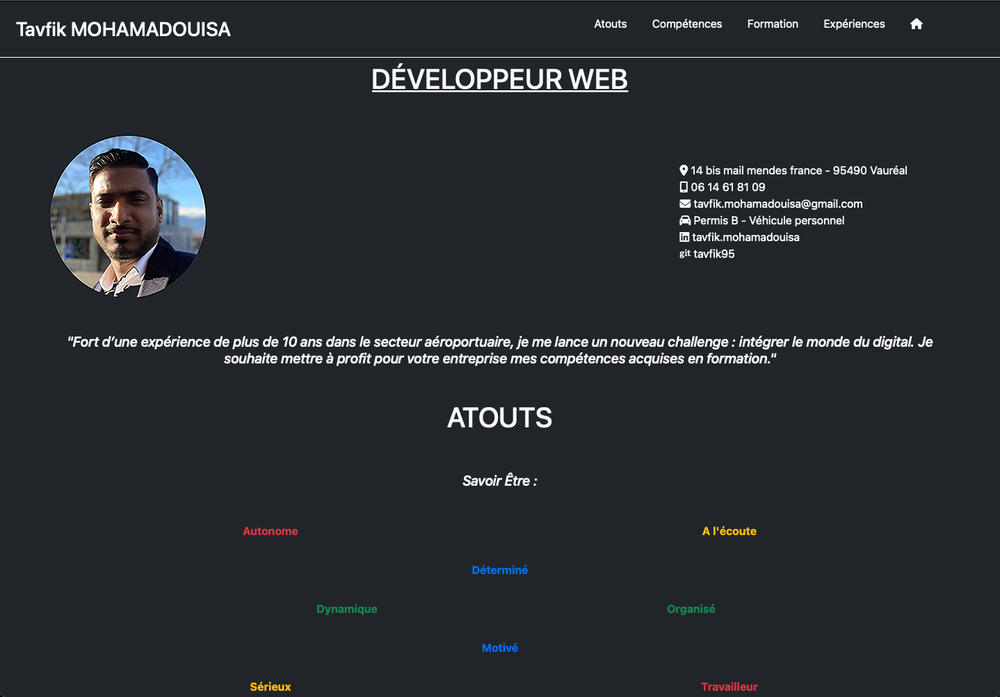
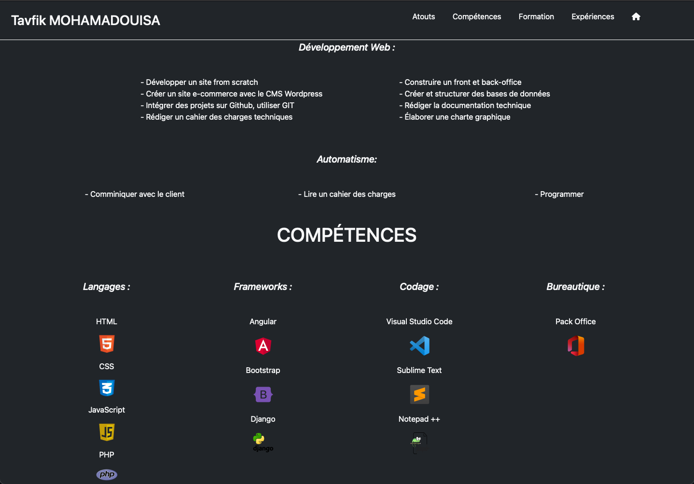
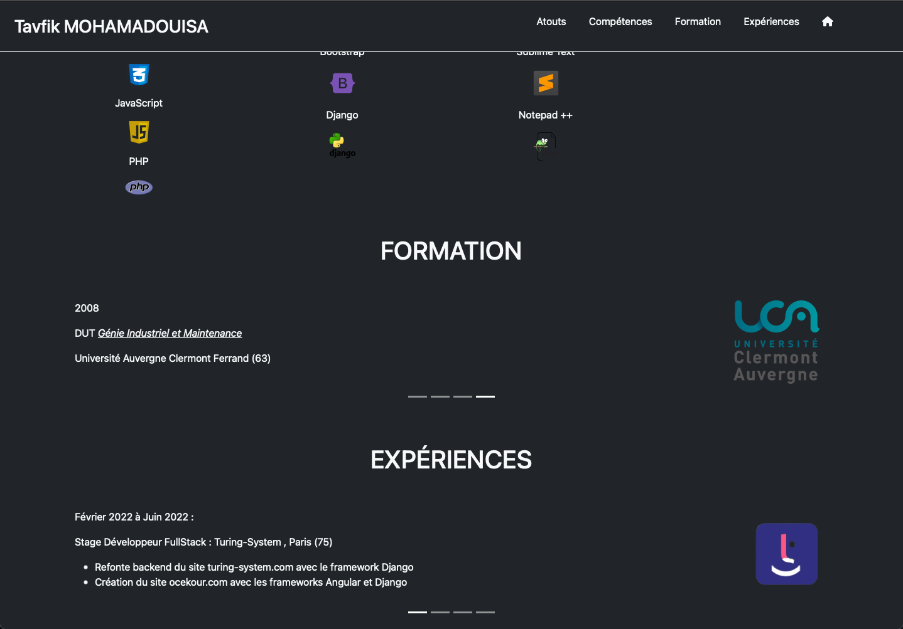

# README
Ce CV numérique est un projet, en single page, développé exclusivement sous Bootstrap.  

Il est possible de naviguer sur la page via les rubriques de la barre de navigation, fixe sur le haut de la page. La navigation se fait avec des liens d'ancrage.  

La navigation dans les différentes formations ou expériences se fait via un carroussel.


##### <center> *Fig.1 CV-information* </center> <br>


##### <center> *Fig.2 CV-compétances* </center> <br>


##### <center> *Fig.3 CV-formations et expériences* </center>  <br>


## 1. Installation

Vous devez cloner le dossier avec la commande suivante : 

```bash
$ git clone <repository>
```


## 2. Lancement 

Le projet se lance en ouvrant le fichier "index.html" sur un navigateur. 